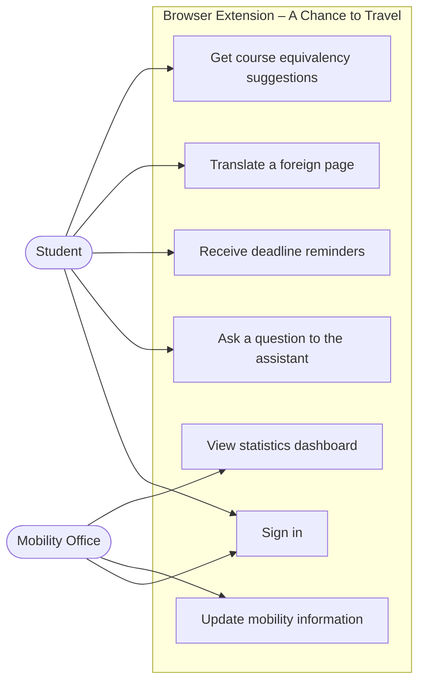

# Use Case Diagram – A Chance to Travel

```mermaid
flowchart LR
    student(["Student"])
    mobility(["Mobility Office"])

    subgraph sys["Browser Extension – A Chance to Travel"]
        UC1["Sign in"]
        UC2["Ask a question to the assistant"]
        UC3["Receive deadline reminders"]
        UC4["Translate a foreign page"]
        UC5["Get course equivalency suggestions"]
        UC6["Update mobility information"]
        UC7["View statistics dashboard"]
    end

    student --> UC1
    student --> UC2
    student --> UC3
    student --> UC4
    student --> UC5

    mobility --> UC1
    mobility --> UC6
    mobility --> UC7
```
