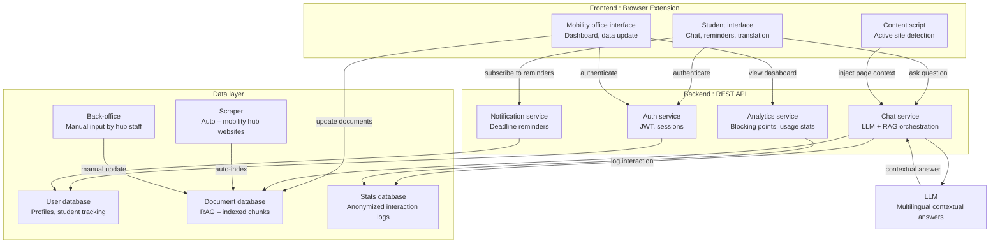

# Architecture Diagram – A Chance to Travel

```mermaid
flowchart TB
    subgraph frontend["Frontend : Browser Extension"]
        UI_STU["Student interface\nChat, reminders, translation"]
        UI_MOB["Mobility office interface\nDashboard, data update"]
        CONTENT["Content script\nActive site detection"]
    end

    subgraph backend["Backend : REST API"]
        AUTH["Auth service\nJWT, sessions"]
        CHAT["Chat service\nLLM + RAG orchestration"]
        NOTIF["Notification service\nDeadline reminders"]
        ANALYTICS["Analytics service\nBlocking points, usage stats"]
    end

    subgraph data["Data layer"]
        DB_USER["User database\nProfiles, student tracking"]
        DB_DOC["Document database\nRAG – indexed chunks"]
        DB_STATS["Stats database\nAnonymized interaction logs"]
        SCRAPER["Scraper\nAuto – mobility hub websites"]
        BACKOFFICE["Back-office\nManual input by hub staff"]
    end

    LLM["LLM\nMultilingual contextual answers"]

    %% Student flows
    UI_STU -->|authenticate| AUTH
    UI_STU -->|ask question| CHAT
    UI_STU -->|subscribe to reminders| NOTIF
    CONTENT -->|inject page context| CHAT

    %% Mobility office flows
    UI_MOB -->|authenticate| AUTH
    UI_MOB -->|update documents| DB_DOC
    UI_MOB -->|view dashboard| ANALYTICS

    %% Backend internal flows
    AUTH --> DB_USER
    CHAT --> DB_DOC
    CHAT --> LLM
    CHAT -->|log interaction| DB_STATS
    NOTIF --> DB_USER
    ANALYTICS --> DB_STATS

    %% Data feeding
    SCRAPER -->|auto-index| DB_DOC
    BACKOFFICE -->|manual update| DB_DOC

    %% LLM response
    LLM -->|contextual answer| CHAT
```
