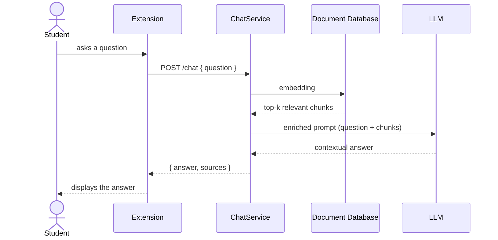

# Sequence Diagram – RAG Flow

```mermaid
sequenceDiagram
    actor Student
    participant Extension
    participant ChatService
    participant DocDB as Document Database
    participant LLM

    Student->>Extension: asks a question

    Extension->>ChatService: POST /chat { question }

    ChatService->>DocDB: embedding
    DocDB-->>ChatService: top-k relevant chunks

    ChatService->>LLM: enriched prompt (question + chunks)
    LLM-->>ChatService: contextual answer

    ChatService-->>Extension: { answer, sources }
    Extension-->>Student: displays the answer
```
